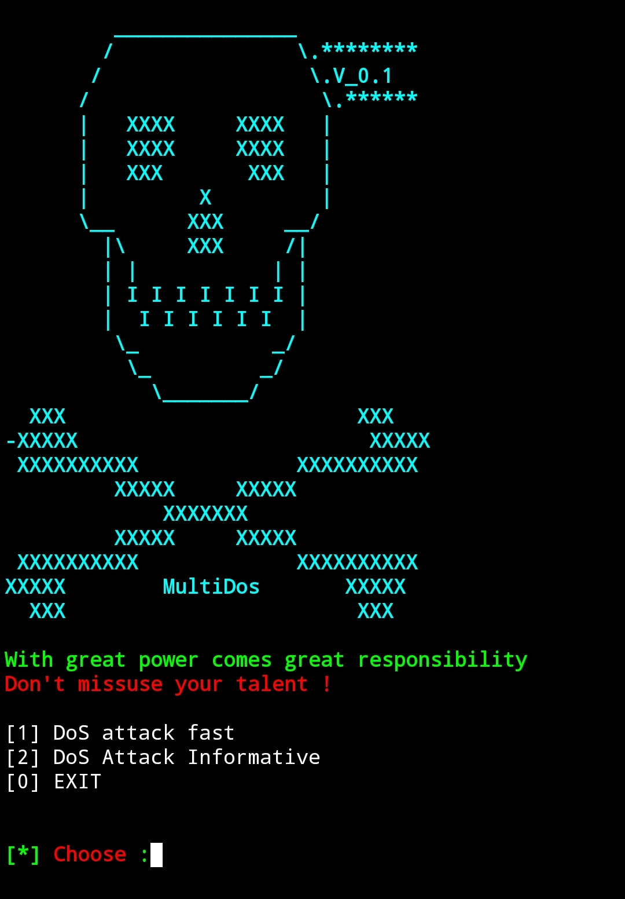

# MultiDos
Powerfull ddos attack tool for termux... 

With this tool you can shutdown any website aur server

[](https://www.facebook.com/alienkrishn) [](https://github.com/Anon4You) 
[](https://youtube.com/@AlienkrishnOrg) 



# Installation
> just copy and paste this command in you termux app
```
curl -sSL https://raw.githubusercontent.com/Anon4You/MultiDos/main/install | bash
```

